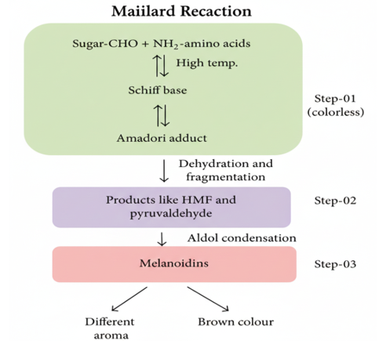

Reducing sugars are responsible for desirable brown color development in many foods through Non-Enzymatic Browning (NEB) reactions. One of the most important NEB reactions is the Maillard reaction, which significantly influences the quality, color, flavor, and safety of thermally processed or stored foods, including citrus products. 
The Maillard reaction occurs between a reducing sugar (aldose or ketose) and a free amino group from an amino acid or protein. The reaction progresses through a sequence of well-defined stages, which can be better understood through a schematic representation. 
 
Initially, the reducing sugar reacts reversibly with an amino group to form a glycosylamine, which undergoes the Amadori rearrangement to produce a more stable Amadori compound. Under acidic conditions (pH ≤ 5), further dehydration reactions lead to the formation of intermediates such as 5-hydroxymethylfurfural (HMF). Under less acidic or prolonged heating conditions, these reactive intermediates polymerize to form dark-colored, high molecular weight compounds known as melanoidins. 
While Maillard browning contributes desirable flavors and colors in frying, roasting, and baking, excessive NEB during processing or storage may result in undesirable color changes, off-flavors, nutrient loss, and formation of compounds such as HMF that may impact food safety. 
Therefore, monitoring the extent of NEB (e.g., by estimating HMF formation) is important for evaluating product quality and safety during processing and storage

<!--Reducing sugars produce brown colors that  are desirable and important in some foods. Non-enzymatic browning (NEB) is one of the most important chemical reactions responsible for quality and color changes during the processing or prolonged storage of citrus fruit products. NEB of foods on heating or on storage is usually due to a chemical reaction between reducing sugars and a free amino acid or a free amino group of an amino acid that is part of a protein chain.  This reaction is called the Maillard reaction. When aldoses or ketoses are heated in solution with amines, a variety of reactions follow, producing numerous compounds, such as flavors, aromas, and dark-colored polymeric materials. The flavors, aromas, and colors may be either desirable or undesirable. They may be produced by frying, roasting, baking, or storage. 
First, the reducing sugar reacts reversibly with the amine to produce a glycosylamine. This undergoes a reaction called the Amadori rearrangement, andit continues, especially at pH 5 or lower, to give an intermediate that dehydrates.Eventually a furan derivative is formed; that from a hexose is 5-hydroxymethyl-2-furaldehyde (HMF). Under less acidic conditions, the reactive cyclic compounds(HMF and others) polymerize to a dark-colored, insoluble material. NEB may lead to some quality losses by altering the final product an unfavorable appearance and even result in reduced food safety due to new formed compounds such as 5-hydroxymethylfurfural (HMF). Since NEB has a significant influence on the product quality and safety, monitoring the extent of such reaction can be a valuable tool for assessing the product quality and safety during processing and prolonged storage. 
