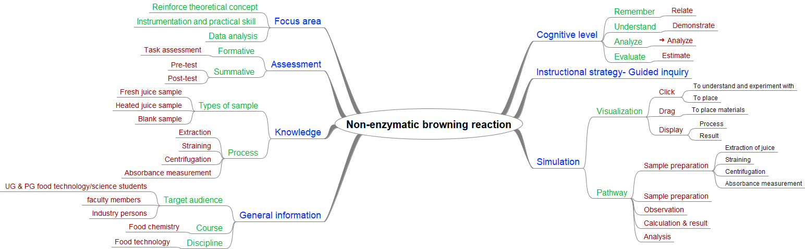

## Storyboard (Round 2)

Experiment 2: Non-enzymatic browning reactions and its determination

### 1. Story Outline:

This experiment involves first of extracting juice sample using electronic juicer and then heating one juice sample using hot plate. Then 5 ml of fresh & heated juice sample is taken in separate centrifuge tubes and add 5 ml ethyl alcohol to each tube and keep these tubes in centrifuge. After completion of centrifugation process, supernatant from both tubes is collected into separate cuvettes. To complete the experiment, absorbance measurement of samples is desirable which starts with calibration of UV-vis spectrophotometer by keeping two cuvettes into the equipment containing ethyl alcohol and making the absorbance to zero (blanking). After that, sample is kept for analysis and absorbance is recorded. Then on the basis of obtained absorbance data final result is calculated.

The main objective of this experiment is to understand non-enzymatic browning reaction and its determination. During the operation student will be able to relate concept of sample preparation and learn new concepts as well as able to experiment with equipments like centrifuge and UV-vis spectrophotometer. User will be able to analyze absorbance of various juice samples. Further based on the absorbance results, user will determine the non-enzymatic browning index of sample as final outcome.

### 2. Story:

First users will get themselves familiar with the experimental set-up and then the juice using electronic juicer and strain the juice for its further use. Then user will heat 10 ml of juice and make two samples one fresh and one heated. After this, user will take 5 ml of each juice sample in separate centrifuge tubes, add 5 ml ethyl alcohol to each tube and keep into centrifuge machine for centrifugation at 5000 rpm for 10 min. Now user will collect the supernatant in separate cuvettes from the tubes A & B. User will calibrate the UV-vis spectrophotometer by keeping two cuvettes containing ethyl alcohol. Then to analyze absorbance of sample, replace one ethyl alcohol with sample cuvette and measure the absorbance at 420 nm. User will. User will record the absorbance value and use it for result. After getting results, user can determine the non-enzymatic browning index of the juice sample.

#### 2.1 Set the Visual Stage Description:

In the simulator user will be able to see the virtual prototype of experimental set up resembling the actual experimental set up that is present in real time labs. Juice extraction electronic juicer is used and for straining a strainer is available. One fresh sample is taken and one sample is prepared after heating using hot plate. The centrifugation machine is used to centrifuge the mixture prepared by adding ethyl alcohol to the 5 ml of sample. For absorbance analysis, UV-vis spectrophotometer is used at 420 nm. Ethyl alcohol is used for blanking before sample analysis. the absorbance value will give final outcome.

#### 2.2 Set User Objectives & Goals:

1.	The prime object of this experiment is to learn about non-enzymatic  browning reactions and its determination.
2.	User will be able to relate the theoretical concept of sample preparation.
3.	User will be able to demonstrate the working of centrifuge. 
4.	User will be able to analyze sample in UV- vis spectrophotometer.
5.	User will be able to estimate non-enzymatic browning index of the samples.

#### 2.3 Set the Pathway Activities:

1.	User will get familiar with all experimental setups and materials/reagents used.
2.	Then extract juice using electronic juicer and strain it.
3.	For sample preparation, add 5 ml fresh strained juice in centrifuge tube A and 5 ml heated juice in tube B.
4.	User will keep both tubes in centrifuge after add 5 ml ethyl alcohol to both tubes.
5.	Simulator will display the centrifugation process as per step.
6.	Once centrifugation is completed, user will collect supernatant from each tube and add to separate cuvettes.
7.	Next for calibration of UV-vis spectrophotometer, user will add 1 ml ethyl alcohol to two other cuvettes and keep them first in the spectrophotometer and make the absorbance zero.
8.	Then, replace one of these cuvettes with sample cuvette of step 6 and check the absorbance at 420 nm.
9.	Repeat the step 8 with the other sample cuvette.
10.	Simulator will provide the result after calculation based on observed data.
11.	By analyzing result values of absorbance, user will be able to determine non-enzymatic browning index of the juice sample.

##### 2.4 Set Challenges and Questions/Complexity/Variations in Questions:

Difficulty level: Remember (LO1)
1.	For analysis of NEBI, Juice sample should be clear having no any suspended matter  
<b>(a)	True</b> 
(b)	False 

Difficulty level: Understand (LO2)

2.	Fine insoluble solid particles can be removed through which of the following process? 
a)	crystallization 
b)	decanting 
<b>c)	centrifuging</b> 
d)	separating funnel 

Difficulty level: Apply (LO3)

3.	visible region fall between the following  
<b>a)	380-750 nm</b>
b)	750nm-1mm 
c)	10 -400 nm 
d)	0.01-10 nm 

Difficulty level: Evaluate (LO5)

4.	Thermally treated juice have higher NEBI value  
<b>a)	True</b> 
b)	False 

##### 2.6 Conclusion:

User will take approximate 5-7 minutes for understanding the procedure. Then for generating data by the help of simulator will take 8-10 minutes. After onwards for calculating result will take 2-3 minutes. Hence, total time taken for doing experiment will be approximately 15-20 minutes.

### 3. Flowchart 4
 
 

### 4. Mindmap:

 
 

### 5. Storyboard :

   
   
   
   
   
   
   
   
   

      
      
